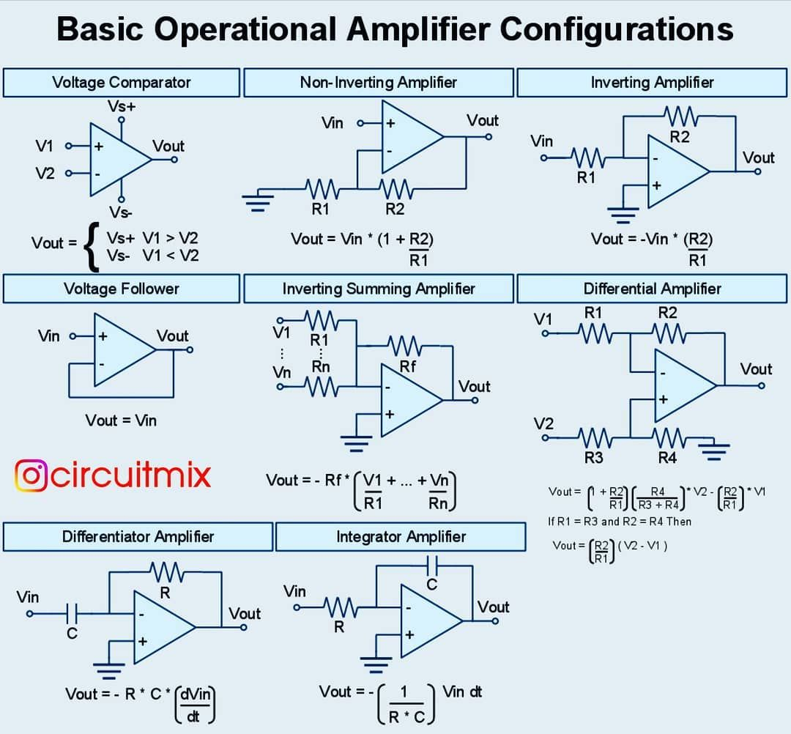

# Comprehensive Guide to CPUs

## Comprehensive Guide to CPUs, Upgrades, and PCIe

This log captures an in-depth exploration of CPUs, their history, features, limitations, and related technologies like PCI Express (PCIe). It is meant to serve as a reference guide for anyone looking to understand or revisit these concepts.

***

### 🔹 1. Modern CPUs at a Glance

* Today’s CPUs contain **tens of billions of transistors** (e.g., >90 billion in cutting-edge chips).
* Each transistor is **smaller than a virus particle**, enabling incredible density.
* CPUs execute **billions of calculations per second**, making them the “brain” of modern computers.
* A CPU chip today (smaller than your fingernail) is more powerful than the supercomputers used during the Apollo moon missions.

***

### 🔹 2. CPU History Highlights

* **1971**: Intel introduced the first microprocessor, **Intel 4004**.
* **1980s**: Intel launched the **80286** and **80386** processors → added multitasking and higher performance.
* **1990s**: **Pentium processors** → improved multimedia capabilities.
* **2000s+**: Intel “Core” processors → focus on efficiency, multi-core designs, and reduced power consumption.
* **Today**: Companies like Intel, AMD, and TSMC continue pushing nanometer (nm) scaling and performance per watt.

***

### 🔹 3. CPU Manufacturing Overview

1. **Raw Silicon** → refined from quartz into ultra-pure silicon (99.999999% purity).
2. **Ingot Creation** → melted and grown into a large cylindrical crystal.
3. **Wafer Slicing** → cut into thin wafers (\~300 mm diameter, 0.75 mm thick).
4. **Photolithography** → UV light and photoresist used to etch billions of tiny circuits.
5. **Etching & Deposition** → materials like copper and oxides form transistor structures.
6. **Doping / Ion Implantation** → atoms like boron or phosphorus are shot into silicon to alter electrical properties.
7. **Layering** → \~80–100 layers stacked to build full CPUs (\~940 steps total).
8. **Testing & Binning** → chips tested, defective ones disabled or sold as lower models (i9 → i7 → i5).
9. **Packaging** → CPU die mounted, heat spreader attached, ready for integration into laptops, desktops, or servers.

***

### 🔹 4. Reading CPU Info (Example: Intel Core i7-3667U)

Using CPU-Z we learned:

* **Model**: Intel Core i7-3667U (3rd Gen, Ivy Bridge, 2012)
* **Cores/Threads**: 2 physical cores, 4 threads (thanks to Hyper-Threading).
* **Base Speed**: 2.0 GHz, with Turbo up to \~3.2 GHz.
* **Technology**: 22 nm process.
* **Cache**:
  * L1: 2 × 32 KB (instruction + data)
  * L2: 2 × 256 KB
  * L3: 4 MB shared
* **Power (TDP)**: 17W, optimized for ultrabooks.
* **Socket**: FCBGA1023 → soldered, not removable.

#### How to Read Intel CPU Names

* **i7-1255U** → “12” = **12th Generation (Alder Lake)**.
* Letters at the end (U, H, HK, etc.):
  * **U** = ultra-low power (for thin laptops)
  * **H** = high performance (gaming/workstation laptops)
  * **K** = unlocked for overclocking

***

### 🔹 5. Memory & I/O Support for i7-3667U

* **Memory**:
  * DDR3/DDR3L, up to 1600 MHz
  * Maximum 32 GB supported
* **I/O Support**:
  * PCI Express 3.0 with up to 16 lanes
  * USB 2.0, USB 3.0 (limited ports depending on chipset)
  * SATA 6 Gb/s for storage

***

### 🔹 6. Can Laptop CPUs Be Upgraded?

* **Most modern laptops** → CPUs are **soldered** (BGA), meaning they **cannot be replaced or upgraded**.
* **Older laptops (pre-2013)** → some used **PGA sockets**, allowing CPU swaps (within same generation & socket).
* **Why not upgrade?**
  * BIOS limitations
  * Cooling system designed only for stock CPU
  * Physical soldering prevents replacement

✅ Easier laptop upgrades:

* **RAM** (if not soldered)
* **Storage (SSD)**
* **Battery, Wi-Fi card**

***

### 🔹 7. PCI Express (PCIe)

**PCIe** is the **high-speed data highway** connecting CPUs to GPUs, SSDs, and other expansion cards.

#### Lanes

* **x1, x4, x8, x16** = number of lanes (like lanes on a highway).
* More lanes = more bandwidth.

#### Versions & Speeds

| Version  | Speed per lane | Speed (x16 slot) |
| -------- | -------------- | ---------------- |
| PCIe 3.0 | \~1 GB/s       | \~16 GB/s        |
| PCIe 4.0 | \~2 GB/s       | \~32 GB/s        |
| PCIe 5.0 | \~4 GB/s       | \~64 GB/s        |
| PCIe 6.0 | \~8 GB/s       | \~128 GB/s       |

#### Uses

* **GPUs** (graphics cards)
* **NVMe SSDs** (storage)
* **Wi-Fi / network cards**
* **Capture cards, sound cards, accelerators**

For i7-3667U (Ivy Bridge):

* Supports **PCIe 3.0**, up to **16 lanes** (usually allocated to GPU).

***

### 🔹 8. Summary

* CPUs are incredibly dense chips with billions of transistors.
* Intel and AMD push generations forward with smaller nm tech and higher efficiency.
* Most modern laptop CPUs are **not upgradeable** (soldered BGA packages).
* Easier upgrades include **RAM and SSDs**.
* **PCIe** is the backbone of data flow between CPU and components, with newer versions doubling speed each generation.
* CPU naming schemes tell you generation and intended use case (U = ultrabook, H = high performance, etc.).

***

Let’s compare the **3rd Gen i7-3667U**, the **8th Gen i7-8565U** (a good mid-point), and the **12th Gen i7-1255U**. This way you’ll clearly see the evolution of Intel laptop CPUs over a decade.

***

## 🔹 CPU Comparison: i7-3667U vs i7-8565U vs i7-1255U

| Feature             | **i7-3667U (3rd Gen, 2012)** | **i7-8565U (8th Gen, 2018)** | **i7-1255U (12th Gen, 2022)**          |
| ------------------- | ---------------------------- | ---------------------------- | -------------------------------------- |
| **Codename**        | Ivy Bridge                   | Whiskey Lake                 | Alder Lake (Hybrid)                    |
| **Cores / Threads** | 2C / 4T                      | 4C / 8T                      | 10C / 12T (2P + 8E)                    |
| **Base Clock**      | 2.0 GHz                      | 1.8 GHz                      | 1.7 GHz (P-cores) / 1.2 GHz (E-cores)  |
| **Turbo Clock**     | Up to 3.2 GHz                | Up to 4.6 GHz                | Up to 4.7 GHz (P-core)                 |
| **Process Node**    | 22 nm                        | 14 nm                        | Intel 7 (≈10 nm Enhanced)              |
| **Cache**           | 4 MB                         | 8 MB                         | 12 MB                                  |
| **TDP**             | 17 W                         | 15 W                         | 15 W (configurable up to \~55 W burst) |
| **Memory Support**  | DDR3/DDR3L (1600 MHz)        | DDR4-2400, LPDDR3-2133       | DDR4-3200, LPDDR4x-4267                |
| **PCIe Support**    | PCIe 3.0 (up to 16 lanes)    | PCIe 3.0                     | PCIe 4.0                               |
| **Integrated GPU**  | Intel HD 4000                | Intel UHD 620                | Intel Iris Xe (up to 96 EUs)           |

***

### 🔹 Key Improvements Over Generations

#### **3rd Gen (i7-3667U, 2012) → 8th Gen (i7-8565U, 2018):**

* **Cores doubled**: 2 → 4
* **Threads doubled**: 4 → 8
* **Cache doubled**: 4 MB → 8 MB
* Huge jump in efficiency: **22 nm → 14 nm**
* Faster memory support: DDR3 → DDR4/LPDDR3
* Much better iGPU (HD 4000 → UHD 620)

⚡ Result: Laptops became much faster at multitasking and everyday workloads (video conferencing, light gaming, office apps).

***

#### **8th Gen (i7-8565U, 2018) → 12th Gen (i7-1255U, 2022):**

* **Cores jumped**: 4 → 10 (hybrid architecture)
* **Threads increased**: 8 → 12
* **Cache improved**: 8 MB → 12 MB
* **Memory speeds doubled**: DDR4-2400 → DDR4-3200 / LPDDR4x-4267
* **PCIe upgrade**: PCIe 3.0 → PCIe 4.0 (faster SSDs and GPUs)
* **Graphics**: UHD 620 → Iris Xe (up to 96 EUs, big boost for gaming & media)
* **Efficiency**: 14 nm → Intel 7 (\~10 nm Enhanced) → much higher performance at same TDP

⚡ Result: A _huge leap_, especially with the hybrid design (P-cores + E-cores), giving you desktop-like performance in a laptop, while staying power efficient.

***

#### **3rd Gen (2012) vs 12th Gen (2022)**

* **Cores**: 2 → 10 (5x increase)
* **Threads**: 4 → 12 (3x increase)
* **Turbo Speed**: 3.2 GHz → 4.7 GHz
* **Cache**: 4 MB → 12 MB
* **Memory**: DDR3 → DDR4/LPDDR4x (much faster, lower power)
* **Graphics**: HD 4000 → Iris Xe (over 10x performance boost in GPU tasks)
* **PCIe**: 3.0 → 4.0 (double the bandwidth)

👉 **In real-world use:** The i7-1255U is around **5–6x faster** in multicore workloads than the i7-3667U, while also being more efficient.

***

✅ **Summary:**

* **i7-3667U (2012)**: Dual-core ultrabook CPU, fine for light office work back then.
* **i7-8565U (2018)**: Quad-core, doubled multitasking ability, modern memory, decent iGPU.
* **i7-1255U (2022)**: Hybrid 10-core design, powerful, efficient, handles heavy multitasking, media editing, and even light gaming.

<figure><figcaption></figcaption></figure>

***

Here’s the **timeline diagram** showing how Intel Core i7 CPUs evolved from **3rd → 8th → 12th gen** in terms of cores and threads.

👉 You can clearly see the **big leap**:

* 3rd Gen: 2C / 4T
* 8th Gen: 4C / 8T
* 12th Gen: 10C / 12T (hybrid architecture)

CPU is only _half_ the story in laptops; the **integrated GPU (iGPU)** determines what kind of graphics workloads (games, video editing, rendering, etc.) your machine can handle. Let’s extend our comparison with deep technical details on the iGPUs **Intel HD 4000 (3rd Gen)**, **Intel UHD 620 (8th Gen)**, and **Intel Iris Xe (12th Gen)**, and also what software/games each setup can realistically run.

***

## 🔹 Integrated GPU Evolution: HD 4000 → UHD 620 → Iris Xe

| Feature                   | **Intel HD 4000** (i7-3667U, 2012) | **Intel UHD 620** (i7-8565U, 2018) | **Intel Iris Xe** (i7-1255U, 2022)               |
| ------------------------- | ---------------------------------- | ---------------------------------- | ------------------------------------------------ |
| **Architecture**          | Gen 7 Graphics                     | Gen 9.5 Graphics                   | Xe-LP (Gen 12)                                   |
| **Execution Units (EUs)** | 16 EUs                             | 24 EUs                             | Up to 96 EUs                                     |
| **Base Clock**            | \~350 MHz                          | \~300 MHz                          | \~400 MHz                                        |
| **Max Dynamic Clock**     | \~1.15 GHz                         | \~1.1 GHz                          | \~1.3 GHz                                        |
| **API Support**           | DX 11, OpenGL 4.0, no Vulkan       | DX 12, OpenGL 4.6, Vulkan 1.0      | DX 12.1, OpenGL 4.6, Vulkan 1.2                  |
| **Memory Type**           | Shared DDR3 (low bandwidth)        | Shared DDR4/LPDDR3                 | Shared DDR4-3200 / LPDDR4x-4267 (high bandwidth) |
| **QuickSync Video**       | Yes (H.264 encode/decode)          | Yes (H.264, HEVC 8-bit)            | Yes (H.264, HEVC 10-bit, VP9, AV1 decode)        |
| **Relative 3DMark Perf.** | \~400                              | \~950                              | \~6000+                                          |

***

## 🔹 What This Means in Practice

#### **Intel HD 4000 (3rd Gen, 2012)**

* **Strengths:**
  * Fine for office apps, 1080p video playback.
  * Can run old/very light games (e.g., _CS:GO_, _Minecraft_, _Skyrim (2011)_ on low settings).
  * QuickSync helped with faster H.264 video playback/encoding back then.
* **Limitations:**
  * No support for modern graphics APIs like Vulkan.
  * Struggles with any modern 3D game or heavy GPU acceleration in creative apps.
  * Bandwidth bottleneck (DDR3).

🔹 _Best for: Browsing, office work, light HD video. Gaming only possible on older titles._

***

#### **Intel UHD 620 (8th Gen, 2018)**

* **Strengths:**
  * \~2.5x faster than HD 4000.
  * Supports modern APIs: DirectX 12, Vulkan, OpenGL 4.6.
  * Can handle light photo/video editing in Adobe apps with GPU acceleration.
  * Can run esports titles (_League of Legends, CS:GO, DOTA 2, Rocket League_) at 720p/1080p low settings.
  * HEVC (H.265) hardware decoding = smooth 4K video playback.
* **Limitations:**
  * Still limited for AAA games (will struggle beyond low settings).
  * Not powerful enough for GPU-heavy workflows (3D rendering, CAD, AI).

🔹 _Best for: Students, office + light creative work, casual gaming (indie & esports)._

***

#### **Intel Iris Xe (12th Gen, 2022)**

* **Strengths:**
  * A huge leap: up to **96 EUs** → 5–6x faster than UHD 620.
  * Comparable to entry-level discrete GPUs (like NVIDIA MX450).
  * Can run modern games (_GTA V, Valorant, Fortnite, Cyberpunk 2077 on Low_) at playable framerates.
  * Excellent for GPU-accelerated tasks: Adobe Premiere Pro, Photoshop, DaVinci Resolve.
  * AV1 hardware decoding = efficient streaming for YouTube, Netflix, etc.
  * Much higher memory bandwidth with LPDDR4x/DDR4-3200.
* **Limitations:**
  * Still not a replacement for mid-tier dedicated GPUs (e.g., GTX/RTX).
  * Performance depends heavily on laptop cooling and power limits.

🔹 _Best for: Modern productivity, serious content creation, casual-to-mid gaming without needing a discrete GPU._

***

## 🔹 Software & Gaming Capability by Generation

#### 🖥 Productivity & Software

* **i7-3667U (HD 4000)** → Office, web, email, light multitasking. Not good for heavy creative work.
* **i7-8565U (UHD 620)** → Office + Adobe Photoshop/Illustrator, light video editing, data science (small sets).
* **i7-1255U (Iris Xe)** → Office + heavy multitasking, full Adobe Suite, CAD (Fusion 360, SolidWorks light models), even AI experiments (TensorFlow/PyTorch CPU + iGPU for small models).

#### 🎮 Gaming

* **i7-3667U (HD 4000):** Older titles only (_Half-Life 2, CS:GO, WoW Classic_) on low settings.
* **i7-8565U (UHD 620):** Esports & indie games (_LoL, DOTA 2, Rocket League, Overwatch, Minecraft_) at 720p/1080p low.
* **i7-1255U (Iris Xe):** Modern AAA games at 720p–1080p low/medium, esports titles at high settings. Comparable to low-end dedicated GPUs.

***

<figure><figcaption></figcaption></figure>

## ✅ TLDR

* **i7-3667U (3rd Gen, HD 4000):** Office work + old games. Struggles with modern workloads.
* **i7-8565U (8th Gen, UHD 620):** Balanced CPU + modest GPU. Great for students, light gaming, productivity.
* **i7-1255U (12th Gen, Iris Xe):** Modern hybrid CPU + strong iGPU. Handles serious work (video editing, coding, light 3D) and can even game decently.

👉 The jump from **HD 4000 → Iris Xe** is like going from a bicycle 🚲 to a motorcycle 🏍 in graphics performance — **night and day difference**.
