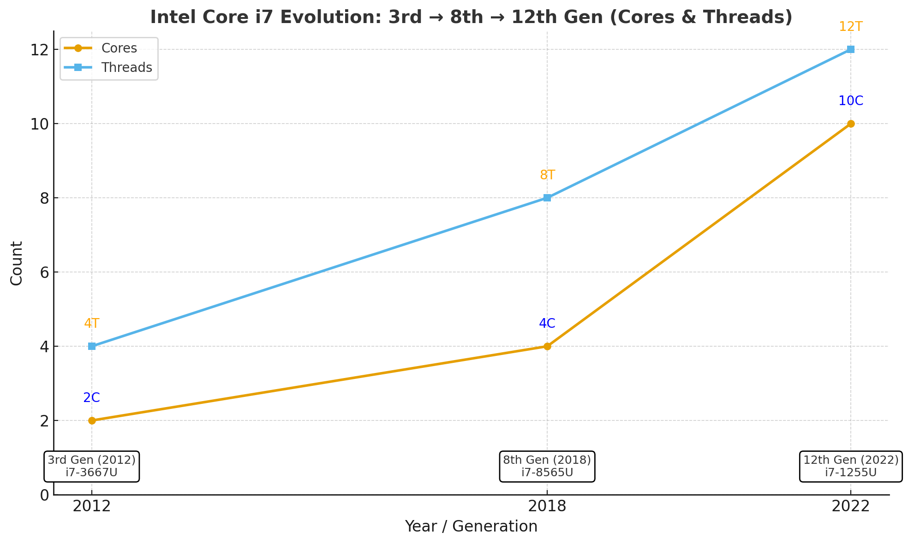

# Operational amplifiers (op amp)

As well as [resistors](https://www.arrow.com/categories/resistors) and [capacitors](https://www.arrow.com/categories/capacitors) that are passive components, operational amplifiers are one of the basic building blocks of analogue electronic circuits.

[Operational amplifiers (op amp)](https://www.arrow.com/en/categories/amplifiers/amplifiers-and-comparators/op-amps) are linear devices that have all the properties required for nearly ideal DC amplification and are therefore used extensively in signal conditioning or filtering or to perform mathematical operations such as adding, subtracting, integration, and differentiation. The purpose of this article is to present 10 basics circuits for newcomers to electronics designs and to refresh the rusty minds of engineers.

### 1. Voltage follower

The most basic circuit is the voltage buffer, as it does not require any external components. As the voltage output is equal to the voltage input, students might become puzzled and wonder whether this kind of circuit has any practical application.

This circuit allows for the creation of a very high impedance input and low impedance output. This is useful to interface logic levels between two components or when a power supply is based on a voltage divider. The figure below is based on a voltage divider, and the circuit cannot function. Indeed, the load impedance can have large variations, so Vout voltage can change dramatically, mainly if the load impedance has a value of the same magnitude as R2.

To solve this issue, an amplifier between the load and the voltage divider (see figure below) is inserted. Thus, Vout depends on R1 and R2 and not on load value.

The primary goal of an operational amplifier, as its names states, is to amplify a signal. For instance, the output of a sensor must be amplified in order to have the ADC measure this signal.

### 2. Inverting op amp

In this configuration, the output is fed back to the negative or inverting input through a resistor (R2). The input signal is applied to this inverting pin through a resistor (R1).

The positive pin is connected to ground.

This is evident in the special case where R1 and R2 are equal. This configuration allows for the production of a signal that is complementary to the input, as the output is exactly the opposite of the input signal.

Due to the negative sign, the output and input signals are out of phase. If both signals must be in phase, a non-inverting amplifier is used.

### 3. Non-inverting op amp

This configuration is very similar to the inverting operation amplifier. For the non-inverting one, the input voltage is directly to the applied to the non-inverting pin and the end of feedback loop is connected to ground.

These configurations allow amplification of one signal. It’s possible to amplify several signals by using summing amplifiers.

### 4. Non-inverting summing amplifier

To add 2 voltages, only 2 resistors can be added on the positive pin to the non-inverting operational amplifier circuit.

It is worth noticing that adding several voltages is not a very flexible solution. Indeed, if a third voltage is added with exactly the same resistances, the formula would be Vs = 2/3 (V1 + V2 + V3).

The resistors would need to be changed to get Vs = V1 + V2 + V3, or a second option is to use an inverting summer amplifier.

### 5. Inverting summing amplifier

By adding resistors in parallel on the inverting input pin of the inverting operation amplifier circuit, all the voltages are summed.

Unlike the non-inverting summing amplifier, any number of voltages can be added without changing resistor values.

### 6. Differential amplifier

The inverting operational amplifier (see circuit number 2) amplified a voltage that was applied on the inverting pin, and the output voltage was out of phase. The non-inverting pin is connected to ground with this configuration.

If the above circuit is modified by applying a voltage through a voltage divider on the non-inverting, we end up with a differential amplifier as shown below.

An amplifier is useful not just because it lets you add, subtract, or compare voltages. Many circuits allow you to modify signals. Let’s see the most basic ones.

### 7. Integrator

A square wave is very easy to generate, by just toggling a GPIO of a microcontroller for example. If a circuit needs a triangle waveform, a good way to do it is just integrating the square wave signal. With an operation amplifier, a capacitor on the inverting feedback path, and a resistor on the input inverting pin as shown below, the input signal is integrated.

Be aware that a resistor is often connected in parallel to the capacitor for saturation issues. Indeed, if the input signal is a very low frequency sine wave, the capacitor acts like an open circuit and blocks feedback voltage. The amplifier is then like a normal open-loop amplifier that has very high open-loop gain, and the amplifier is saturated. Thanks to a resistor in parallel of the capacitor, the circuit behaves like an inverting amplifier with a low frequency, and saturation is avoided.

### 8. Op amp differentiator

The differentiator works similarly to the integrator by swapping the capacitor and the resistor.

All the configurations that were presented up to now.

### 9. Converter current – voltage

A [photodetector](https://www.arrow.com/en/categories/optoelectronics/photoelement/photodetectors) converts light into current. To convert the current into voltage, a simple circuit with an operational amplifier, a feedback loop through a resistor on the non-inverting, and the diode connected between the two input pins allows you to get an output voltage proportional to current generated by the photodiode, which is evident by the light characteristics.

The above circuit applies Ohm’s law with the fundamental formula: voltage is equal to resistance multiplied by current. The resistance is in Ohms and is always positive. But thanks to operational amplifiers, a negative resistance can be designed!

### 10. Negative resistance

A feedback on the inverting pin forces the output voltage to be the double of the input voltage. As the output voltage is always higher than the input voltage, the positive feedback through the R1 resistor on the non-inverting pin simulates a negative resistance.

Finally, a circuit with operational amplifier does not necessarily modify the input signal, but records it like the peak detector amplifier.

### Also: Peak detector operation amplifier

The capacitor is used as a memory. When the input voltage on the non-inverting input is higher than the voltage on the inverting input that is also the voltage across the capacitor, the amplifier enters in saturation and the diode is forward and charges the capacitor. Assuming the capacitor does not have a quick self discharge, when the input voltage Ve is lower than voltage across the capacitor, the diode is blocked. Hence, the peak voltage is recorded thanks to the capacitor.

Many more circuits are available with operational amplifiers, but understanding these fundamental 10 circuits allows you to easily study more complex circuits.

<figure><figcaption></figcaption></figure>
